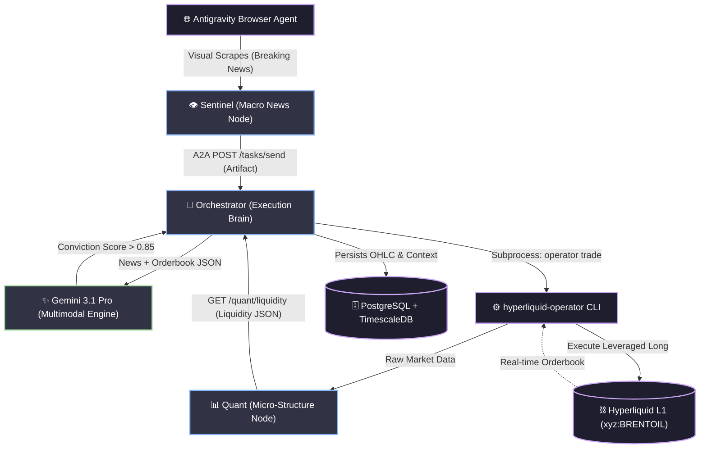

<div align="center">
  
</div>

# Project Slick (Hyperliquid Edition)

> **We are live at `slicktrader.xyz` (domain registered today, 2026-03-21).**

**Project Slick** is an autonomous trading bot built on an A2A-connected Python agent swarm. Its purpose is to arbitrage real-time Middle East geopolitical sentiment (visually scraped using Antigravity) against on-chain [xyz:BRENTOIL](https://app.hyperliquid.xyz/trade/xyz:BRENTOIL) perpetual futures order book dynamics on Hyperliquid L1.

## The Agentic Swarm Architecture

The core of Slick is a trio of modular Python agents negotiating via FastAPI.



### 1. Sentinel
* **Endpoint:** `POST /sentinel/trigger`
* **Role:** The Macro News Node. Triggered by a Browser Subagent that has captured breaking visualizations or text headlines regarding Middle East Geopolitical events.
* **Flow:** Formats the captured artifacts and pushes it to the Orchestrator via an A2A `tasks/send` invocation.

### 2. Quant
* **Endpoint:** `GET /quant/liquidity`
* **Role:** The Micro-Structure Node. Connects via subprocess to `hyperliquid-operator`, evaluating real-time depth for the xyz:BRENTOIL perpetuals market.
* **Flow:** Exposes a JSON payload detailing the current structural liquidity and funding rates.

### 3. Orchestrator
* **Endpoint:** `POST /orchestrator/tasks/send`
* **Role:** The Execution Brain. Feeds the visual artifact alongside the micro-structure JSON to the Gemini 3.1 Pro multimodal framework.
* **Flow:** Analyzes for "Bullish Sentiment" $> 0.85$. If conditions and structural liquidity intersect, fires a leveraged long trade using the local CLI tools.

## Development Setup

1. **Install dependencies using uv:**
   ```bash
   uv sync
   # Ensure dependencies are installed: fastapi, uvicorn, google-genai, etc.
   ```
2. **Environment Variables:**
   A `.env` file is required in the project root.
   ```env
   GEMINI_API_KEY=your-api-key-here
   ORCHESTRATOR_URL=http://localhost:8000/orchestrator
   QUANT_URL=http://localhost:8000/quant
   ```
3. **Hyperliquid Operator Integration:**
   `hyperliquid-operator` must be cloned in the project root:
   ```bash
   git clone https://github.com/algo-traders-club/hyperliquid-operator.git
   ```
   Follow its nested `README.md` to configure the trading Wallet credentials.

4. **Running the Swarm Locally:**
   ```bash
   uv run uvicorn main:app --reload
   ```

5. **Running the Frontend Dashboard:**
   The repository includes a Next.js 14 frontend proxying API requests to the Python backend.
   ```bash
   cd frontend
   npm install
   npm run dev
   ```
   *Dashboard available at: `http://localhost:3000/dashboard`*

## Production Deployment (Digital Ocean)

Slick is containerized using multi-stage Docker builds natively orchestrating the FastAPI backend alongside a `standalone` optimized Next.js 14 frontend. 

1. **Clone & Configure:**
```bash
git clone https://github.com/algo-traders-club/slick.git
cd slick
nano .env # Paste your GEMINI_API_KEY and other credentials
```

2. **Spin up the Swarm:**
```bash
docker compose up --build -d
```

3. **Accessing:**
The dashboard is served via nginx on the droplet and is live at [https://slicktrader.xyz/dashboard](https://slicktrader.xyz/dashboard).

## Verified Performance & On-Chain Proof
Every trade executed by the swarm is recorded on the Hyperliquid L1.
- **Trader Address**: `0x517CFeae25Ac7D49aD70037b253B9f24C7E556Cf`
- **Dashboad Metrics**: Real-time Win Rate, Equity, Total Fills, and Open Positions.
- **Verification**: [Hyperliquid Search](https://app.hyperliquid.xyz/tradeHistory/0x517CFeae25Ac7D49aD70037b253B9f24C7E556Cf)

## Tech Stack
* Python 3.12+ (uv-based)
* FastAPI + Pydantic + asyncpg
* Local PostgreSQL + TimescaleDB Extension
* google-genai
* algo-traders-club/hyperliquid-operator
* Next.js 14 (App Router) + Tailwind CSS + Framer Motion
* Docker Compose
